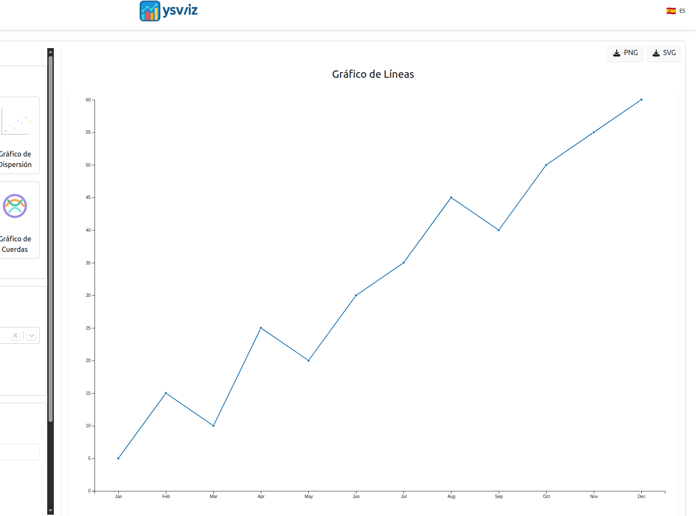

# Flujo de Trabajo

  

Ysyviz sigue un flujo de trabajo simple y intuitivo dividido en 4 pasos principales, en esta sección los iremos desgranando 1 a 1

  

## 1. Subida de Fichero

Al abrir la aplicación nos aparecera un recuador donde nos indica donde tenemos que subir el fichero. Una vez subamos el fichero nos indicará cual es el fichero que hemos subido y luego tendremos que darle a el botón de subida.

### Formatos Soportados

-  **CSV**: Archivos de texto separado por comas

-  **XLSX**: Archivos de Excel

  

### Métodos de Carga

-  **Drag & Drop**: Arrastra el archivo directamente a la zona de carga

-  **Selección Manual**: Haz clic en "Seleccionar archivo" y navega hasta tu archivo

  

### Validación Automática

- Verificación de formato de archivo

- Detección de estructura de datos

- Identificación de columnas disponibles

- Mensajes de confirmación o error

  

## 2. Selección de Gráfico

Una vez que hayamos seleccionado el gráfico, nos desplazaremos a la sección 'Vista previa y descarga' para poder seleccionar el gráfico deseado, en esta vista nos encontraremos a la izquierda una menú donde podremos seleccionar que tipo de gráfico queremos pintar, en la zona de la derecha encontraremos la zona donde se renderizará el gráfico, este menú tiene paginación por lo que hay varias páginas para mostrar todos los gráficos. Una vez clickado el gráfico nos aparecer el borde azul indicando que lo tenemos seleccionado.

## 3. Configuración de Datos

Cuando tengamos tanto el gráfico seleccionado como el tipo de gráfico que queramos, nos aparecerán los paneles de configuración personalziados de cada gráfico

### Mapeo de columnas

Panel donde aparecen los campos para representar los datos de los ejes, en el podremos elegir que tipo de dato queremos representar en nuestro gráfico

-  **Campos Obligatorios**: Marcados claramente con un asterisco rojo

-  **Campos Opcionales**: Para añadir más información a los gráficos pero no son necesarios 

-  **Validación en Tiempo Real**: Errores inmediatos
  

### Opciones de apariencia

Panel donde aparecen los campos para representa la estética que le queremos dar a nuestro gráfico

- Colores y paletas

- Títulos y etiquetas

- Leyendas y posicionamiento

### Opciones de Personalización

- Configuraciones específicas por tipo

## 4. Renderizado

Si hemos completado correctamente los demás pasos nos aparecerá el gráfico ya renderizamos, si modificamos cualquiera de estos  cambios los cambios se aplicarán en tiempo real y cambiará el gráfico. Próximo al gráfico nos aparecerán los botones para descargar nuestro gráfico en PNG o SVG.

### Resultado Final

- Gráfico que cambia en tiempo real
- Listo para exportación en PNG o SVG
  

  

[← Volver al Manual](./) | [→ Configuraciones por Tipo](./chart-configs)